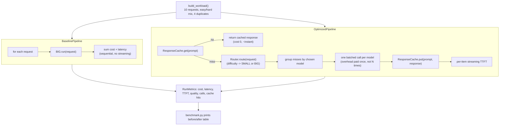

# LLM Cost & Latency Optimization — Measured


> **AI Engineer Roadmap — Project 5.3**
> *Teaches: the constraints that dominate real production AI, profiling, tradeoff thinking.*
> *Done when: you cut cost or latency by a measurable amount without losing quality.*

Takes an LLM app and makes it **measurably cheaper and faster** with the four
levers that matter in production — **caching, model-tier routing, batching, and
streaming** — while keeping answer **quality identical**. Everything is simulated
deterministically (a mock LLM with fixed per-call cost and latency), so the
benchmark is reproducible, runs instantly, and needs no API key.

## What it does

Two pipelines run the exact same 10-request workload (a mix of easy/hard
questions with duplicates) and both are scored on cost, latency, time-to-first
byte, and answer quality against known-correct ("gold") answers:

- **`BaselinePipeline`** — one call to the big model per request. No cache, no
  routing, no batching, no streaming.
- **`OptimizedPipeline`** — cache → route → batch → stream, in that order.

Because both pipelines are graded against the same gold answers, the benchmark
proves the savings are free — not a quality trade-off.

## Architecture



| Lever | Module | What it saves | How |
| --- | --- | --- | --- |
| **Caching** | `cache.py` | repeated work | duplicate prompts (normalised: trimmed + lower-cased) return a stored answer for ~0 cost and ~0 latency |
| **Routing** | `router.py` | money on easy queries | a difficulty estimate sends easy requests to a cheap/fast model, escalating to the big model only when needed |
| **Batching** | `pipeline.py` | per-call overhead | requests sharing a model go out in one call, so fixed overhead is paid once instead of N times (10 calls → 2) |
| **Streaming** | `pipeline.py` | *perceived* latency | time-to-first-token drops 90% — the user sees output almost immediately even when total work is unchanged |

### Why quality is preserved

The cheap model (`SMALL`) is only right on *easy* items; the router sends
*hard* items to the big model (`BIG`). So every answer stays correct
(accuracy 1.0) — the savings come from not over-paying for the easy ones, not
from accepting worse answers. That distinction (cheaper ≠ worse, when routed
well) is the whole point, and it's asserted directly in
`tests/test_llmopt.py::test_quality_is_preserved`.

## Quickstart

```bash
python -m venv .venv && source .venv/bin/activate   # Win: .\.venv\Scripts\activate
pip install -e ".[dev]"
python benchmark.py    # before/after table
pytest -q              # 13 tests
```

### Actual output (`python benchmark.py`)

```
Workload: 10 requests

metric                      baseline     optimized          change
Total cost ($)                   0.1         0.024       76% lower
Total latency (ms)              8200          2120       74% lower
Mean TTFT (ms)                   820          84.8       90% lower
Quality (accuracy)                 1             1            same
Model calls                       10             2
Cache hits                         0             4

Quality preserved while cost and latency dropped — optimisation wins.
```

Cost and latency cut by ~75% with zero quality loss — the project's "Done
when", proven with numbers rather than asserted.

## Project structure

```
src/llmopt/
├── models.py     # simulated BIG/SMALL models (cost, latency, competence) + Request/Response dataclasses
├── cache.py      # normalised-prompt response cache
├── router.py     # pluggable difficulty estimator + model selection (SMALL vs BIG)
├── pipeline.py   # BaselinePipeline and OptimizedPipeline + RunMetrics
└── workload.py   # a representative mixed workload with duplicates
benchmark.py       # runs both pipelines on the workload, prints the before/after table
tests/
├── test_llmopt.py    # 12 tests: each lever in isolation + end-to-end savings + quality gate
└── test_benchmark.py # 1 test: the benchmark.py CLI entry point runs and reports a win
```

## Key design decisions

- **Deterministic mock models instead of real API calls.** `Model.run()` returns
  a fixed cost/latency/correctness triple based on a `difficulty` label — no
  network calls, no API key, no variance. This makes the benchmark reproducible
  and lets tests assert exact numbers instead of flaky timing.
- **Cache keyed on normalised text, not embeddings.** `_key()` lower-cases and
  collapses whitespace so trivial formatting differences still hit; this is
  exact-match deduplication, not semantic similarity.
- **Router estimator is pluggable.** `Router.__init__` accepts any
  `Callable[[Request], str]`; `default_estimator` trusts the request's explicit
  difficulty label but also escalates prompts over 40 words to "hard" as a
  content-based safety net.
- **Batching groups misses by chosen model.** After cache and routing, at most
  two model groups remain (`small`, `big`), so at most two calls are made
  regardless of workload size — the per-call `CALL_OVERHEAD_MS` is paid once
  per model instead of once per request.
- **Quality is a gate, not a footnote.** Every pipeline run computes accuracy
  against gold answers, and both `benchmark.py` and the test suite assert the
  optimized run's quality is never lower than the baseline's — a change that
  saves cost by silently hurting answers fails loudly.

## Limitations

- The models are simulated: `Model.run()` never calls a real LLM API, so the
  exact dollar/millisecond figures do not transfer directly — only the
  methodology does.
- Difficulty is either an explicit label on the `Request` or a naive
  word-count heuristic, not a learned classifier — a real router needs a
  calibrated difficulty or complexity estimator.
- The cache is exact-match on normalised text; near-duplicate paraphrases
  ("What's 2+2?" vs "What is 2 + 2?") are not deduplicated.
- Cache and metrics live only for the lifetime of an `OptimizedPipeline`
  instance — there's no persistence or cross-process sharing.
- No concurrency, retries, rate limits, or partial-failure handling are
  modeled; a production pipeline needs all of these.
- No CI is configured yet; tests must currently be run locally.

## Roadmap

- `--live` mode that swaps the mock `Model` for a real provider client, so
  cost/latency are measured against actual API calls instead of simulated.
- Semantic (embedding-based) cache to catch near-duplicate prompts, not just
  exact-normalised matches.
- A learned or confidence-scored router instead of a label/word-count
  heuristic.
- GitHub Actions workflow to run `pytest` (and `benchmark.py`) on every push.
- Coverage reporting.

## License

MIT.
